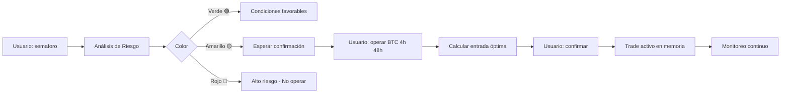

# 🚦 SemáforoBot - Bot de Trading con Análisis de Riesgo

Bot de trading modular que opera en criptomercados según análisis de riesgo derivado de múltiples indicadores (Open Interest, Funding Rate, Liquidation Maps, Long/Short Ratio).

## 🎯 Características

- ✅ **Análisis de Riesgo Completo**: Integra múltiples métricas para determinar color del semáforo (🟢🟡🔴)
- ✅ **Comandos Naturales**: Opera con lenguaje natural como "semaforo", "operar BTC 4h 48h"
- ✅ **Memoria Persistente**: Recuerda análisis, trades activos y configuración usando Redis
- ✅ **API Local**: FastAPI con endpoints REST para integración externa
- ✅ **Optimización de Entradas**: Calcula puntos óptimos de entrada, SL y TP
- ✅ **Multi-Asset**: Soporta BTC, ETH, SOL (expandible)

## 📋 Requisitos

- Python 3.11+
- Redis Server (para memoria persistente)
- Cuenta en exchange (Binance, etc.) para trading real

## 🚀 Instalación

### 1. Clonar el repositorio

```bash
cd "d:\Proyectos\Bot semaforo"
```

### 2. Crear entorno virtual

```powershell
python -m venv venv
.\venv\Scripts\Activate.ps1
```

### 3. Instalar dependencias

```powershell
pip install -r requirements.txt
```

### 4. Instalar y configurar Redis

**Windows:**
```powershell
# Opción 1: Usar WSL2
wsl --install
wsl
sudo apt update
sudo apt install redis-server
redis-server

# Opción 2: Docker
docker run -d -p 6379:6379 redis:latest
```

**Linux/Mac:**
```bash
# Ubuntu/Debian
sudo apt install redis-server
sudo systemctl start redis

# Mac
brew install redis
brew services start redis
```

### 5. Configurar variables de entorno

```powershell
cp .env.example .env
# Editar .env con tus credenciales
```

Configurar en `.env`:
- `REDIS_HOST`, `REDIS_PORT` (si Redis está en otra ubicación)
- `COINGLASS_API_KEY` (opcional, para datos reales)
- `EXCHANGE_API_KEY`, `EXCHANGE_API_SECRET` (para trading real)

## 🎮 Uso

### Iniciar el bot

```powershell
python main.py
```

El servidor se iniciará en `http://localhost:8000`

### Interfaz Web (Swagger UI)

Abre en tu navegador: `http://localhost:8000/docs`

### Comandos disponibles

#### 1. 🚦 Análisis de Semáforo

**Endpoint:** `POST /analyze`

```json
{
  "assets": ["BTC", "ETH", "SOL"],
  "force_refresh": false
}
```

**Respuesta:**
```json
{
  "semaforo": "yellow",
  "emoji": "🟡",
  "assets": {
    "BTC": {
      "color": "yellow",
      "risk_score": 45.5,
      "probabilities": {
        "long": 55,
        "short": 45
      }
    }
  },
  "recommendation": "Riesgo medio. Esperar confirmación..."
}
```

#### 2. 📊 Preparar Trade

**Endpoint:** `POST /trade`

```json
{
  "asset": "BTC",
  "timeframe": "4h",
  "duration": "48h",
  "leverage": 1.0
}
```

**Respuesta:**
```json
{
  "status": "pending_confirmation",
  "trade": {
    "entry_price": 65000,
    "stoploss": 64350,
    "takeprofit": 66300,
    "direction": "long"
  },
  "message": "Entrada ideal en 65000, SL 1%, TP 2%. ¿Confirmar trade?"
}
```

#### 3. ✅ Confirmar Trade

**Endpoint:** `POST /confirm`

```json
{}
```

#### 4. ⚙️ Configurar Parámetros

**Endpoint:** `POST /config`

```json
{
  "stoploss_percent": 1.5,
  "takeprofit_percent": 3.0,
  "max_trades": 5
}
```

#### 5. 📋 Ver Trades Activos

**Endpoint:** `GET /trades/active`

#### 6. 🔒 Cerrar Trade

**Endpoint:** `POST /trades/{trade_id}/close`

## 🏗️ Estructura del Proyecto

```
Bot semaforo/
├── main.py                    # Servidor FastAPI y punto de entrada
├── config.json                # Configuración de umbrales y parámetros
├── redis_store.py             # Gestión de Redis
├── requirements.txt           # Dependencias Python
├── .env.example               # Plantilla de variables de entorno
├── strategy/                  # Módulos de estrategia
│   ├── __init__.py
│   ├── risk_analyzer.py       # Análisis de riesgo y semáforo
│   ├── entry_optimizer.py     # Optimización de entradas/salidas
│   └── memory_manager.py      # Gestión de memoria persistente
└── data_adapter/              # Adaptadores de datos
    ├── __init__.py
    └── coinglass_adapter.py   # Integración con CoinGlass API
```

## 🔧 Configuración Avanzada

### Ajustar Umbrales de Riesgo

Editar `config.json`:

```json
{
  "risk_thresholds": {
    "green": {
      "funding_rate_max": 0.02,
      "oi_change_24h_max": 15,
      ...
    }
  }
}
```

### Agregar Nuevos Activos

En `config.json`, sección `assets`:

```json
{
  "assets": {
    "AVAX": {
      "symbol": "AVAX/USDT",
      "default_timeframe": "4h",
      "min_volume_24h": 50000000,
      "volatility_weight": 1.8
    }
  }
}
```

## 🧪 Testing

### Test de Redis

```powershell
python redis_store.py
```

### Test de Data Adapter

```powershell
python data_adapter/coinglass_adapter.py
```

## 📊 Flujo de Trabajo Típico



## 🔐 Seguridad

- ⚠️ **NUNCA** commits archivos `.env` con credenciales reales
- ⚠️ Usa `EXCHANGE_TESTNET=true` para pruebas
- ⚠️ Comienza con posiciones pequeñas
- ⚠️ Verifica siempre el semáforo antes de operar

## 🐛 Troubleshooting

### Redis no conecta

```powershell
# Verificar que Redis esté corriendo
redis-cli ping
# Debería responder: PONG

# Si no funciona, reiniciar Redis
# En WSL: sudo service redis-server restart
# En Docker: docker restart <container_id>
```

### Error de imports

```powershell
# Asegurarse de estar en el entorno virtual
.\venv\Scripts\Activate.ps1

# Reinstalar dependencias
pip install -r requirements.txt --force-reinstall
```

## 🚧 Próximas Mejoras (TODO)

- [ ] Integración real con CoinGlass API
- [ ] Ejecución real de trades con CCXT
- [ ] Webhook para notificaciones (Telegram/Discord)
- [ ] Backtesting de estrategias
- [ ] Dashboard web interactivo
- [ ] Machine Learning para mejorar predicciones
- [ ] Soporte para más exchanges

## 📝 Ejemplo de Uso Completo

```python
import requests

API_URL = "http://localhost:8000"

# 1. Analizar mercado
response = requests.post(f"{API_URL}/analyze", json={
    "assets": ["BTC", "ETH"]
})
analysis = response.json()
print(f"Semáforo: {analysis['emoji']}")

# 2. Si está verde o amarillo, preparar trade
if analysis['semaforo'] in ['green', 'yellow']:
    response = requests.post(f"{API_URL}/trade", json={
        "asset": "BTC",
        "timeframe": "4h",
        "duration": "48h"
    })
    trade = response.json()
    print(f"Entrada: {trade['trade']['entry_price']}")
    
    # 3. Confirmar si estamos de acuerdo
    input("Presiona Enter para confirmar...")
    response = requests.post(f"{API_URL}/confirm")
    print("✅ Trade confirmado!")

# 4. Ver trades activos
response = requests.get(f"{API_URL}/trades/active")
print(f"Trades activos: {response.json()['count']}")
```

## 📄 Licencia

Este proyecto es de código abierto. Úsalo bajo tu propia responsabilidad.

## 🤝 Contribuciones

¡Las contribuciones son bienvenidas! Por favor:

1. Fork el proyecto
2. Crea una rama para tu feature (`git checkout -b feature/AmazingFeature`)
3. Commit tus cambios (`git commit -m 'Add some AmazingFeature'`)
4. Push a la rama (`git push origin feature/AmazingFeature`)
5. Abre un Pull Request

## ⚠️ Disclaimer

Este bot es solo para fines educativos. El trading de criptomonedas conlleva riesgos significativos. No soy responsable de pérdidas financieras derivadas del uso de este software.

**Usa siempre el modo testnet primero y opera con capital que puedas permitirte perder.**

---

**Creado con ❤️ para la comunidad crypto**

🚦 **Trade smart, not hard!**
